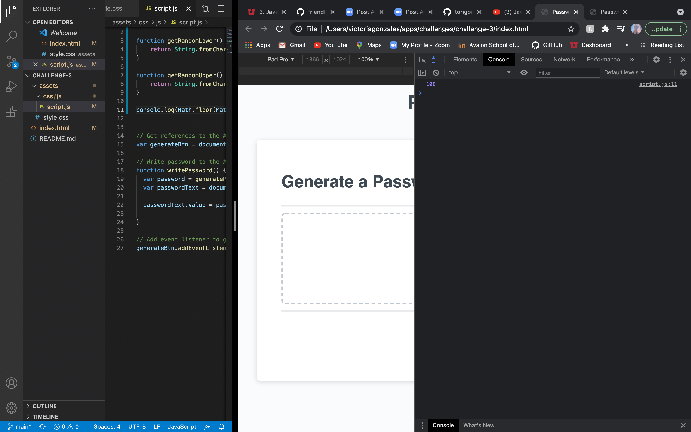
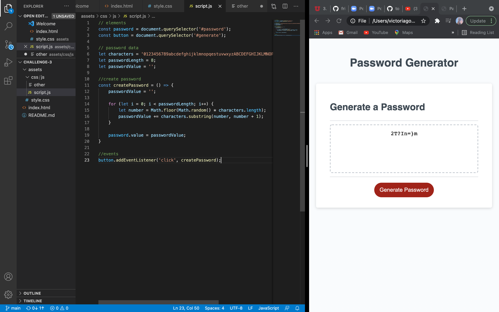
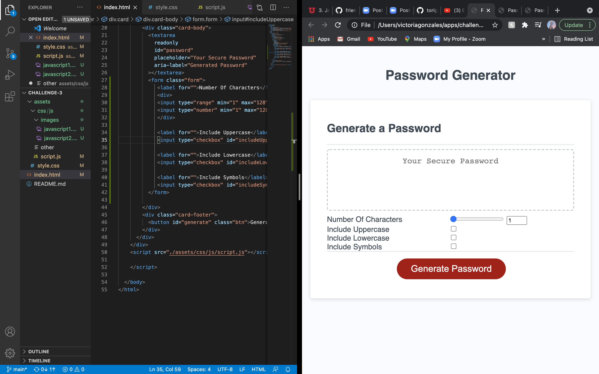
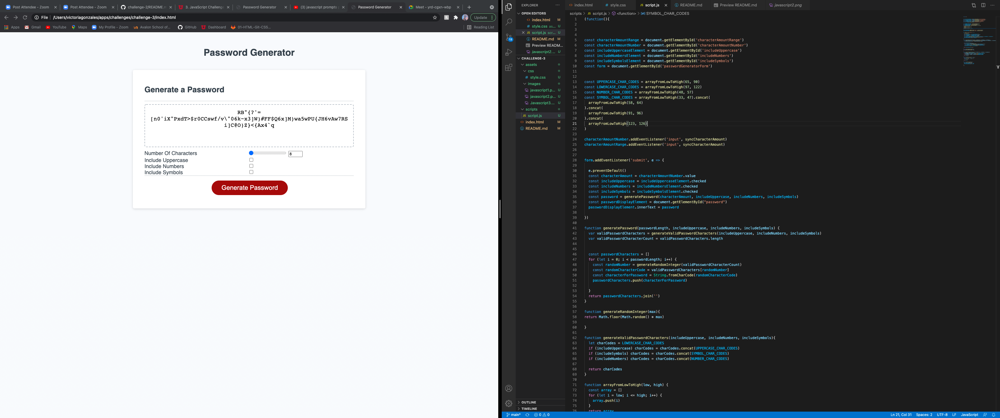
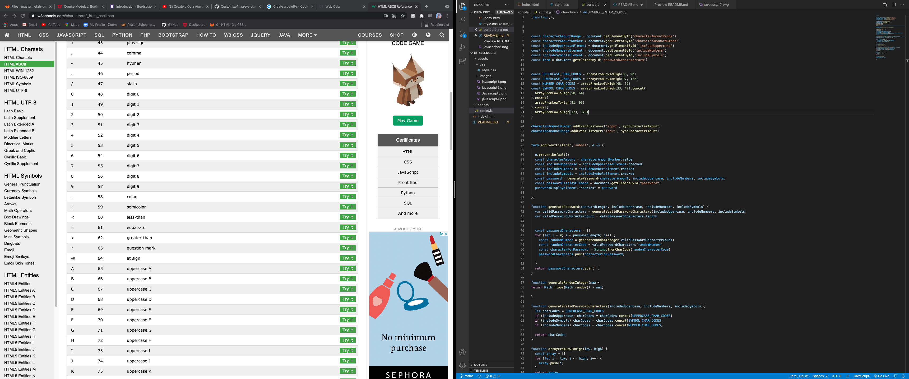

# Challenge 3- JavaScript Password Generator 
> JavaScript, JavaScript, JavaScript!
---
### Table of Contents
- [Description](#description)
- [Introduction](#introduction)
- [Challenges](#challenges)
- [Victories](#victories)
- [Resources](#resources)

---

## Description

Challenge #3- Secure Password Generator  

## Introduction 
This weeks challenge was challenging to say the least! We were required to create a password generator that populated a random secure password. 

---

## Challenges
My biggest challenges this week, were really just the learning curve of JavaScript and getting used to the syntax. 

Using the console to make sure that my math was populating correctly was a huge resource when it came to creating this. 

---

I was able to get a pasword to generate. 

---
I also created checked boxes to make the user experience a little more clear as to what was required for their password. 

---

## Victories
After several hours of refactoring the syntax I was able to successfully generate a password with specific characteristics! 

---

I decided to use Character Codes to create more oraganized code, instead of long arrays. 

---

## Resources 

<a href="https://github.com/torigonzales/challenge-3">GitHub Repo</a>

<a href="https://www.youtube.com/watch?v=eVGEea7adDM"> YouTube</a>

<a href="https://www.google.com/webhp?hl=en&sa=X&ved=0ahUKEwiLjJ7fosLvAhWXW80KHawRD_oQPAgI">Google</a>

<a href="https://www.w3schools.com/charsets/ref_html_ascii.asp">w3 Schools</a>

